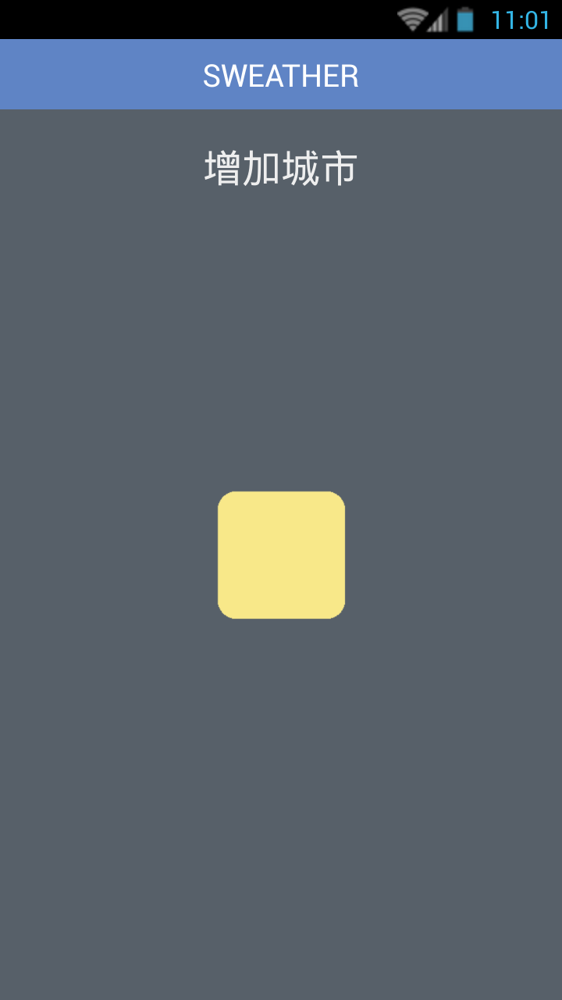
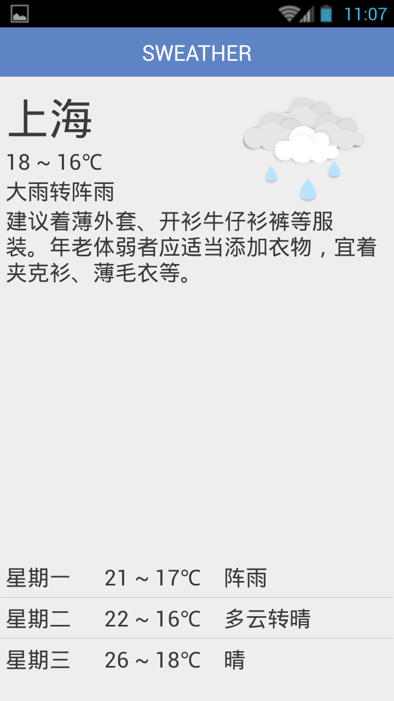

#  SWeather
Delicate android weather app by viewpager and fragments
***
SWeather is a weather app based on a dynamic viewpager containing serveral fragments.  
You can add different cities to get 3-days weather reports.  
Only support cities in China.  
Some resources extract from Baidutieba and Tianqitong.  

[Download](http://www.seeleit.com/static/files/SWeather.apk)

## How to use
Min SDK : 8  
Add : Tap the center button.    
Change : Tap the city name.   
Delete : Swipe down from the title bar then swipe up.  

The app uses the weather interface of [baidu](http://lbsyun.baidu.com/index.php?title=car/api/weather).  
You can change it to another one in the WeatherProvider class to support more cities. 
 
## Screenshots

> If you have any problem, please contact hevlhayt@foxmail.com (ﾉﾟ▽ﾟ)ﾉ
